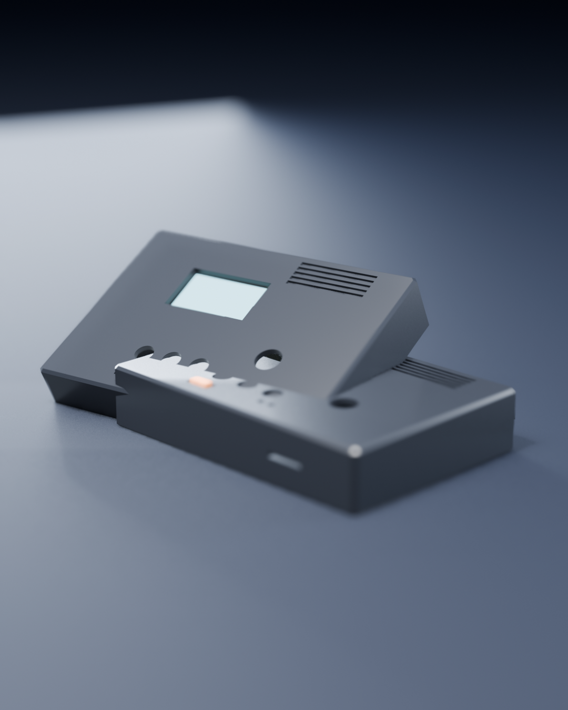
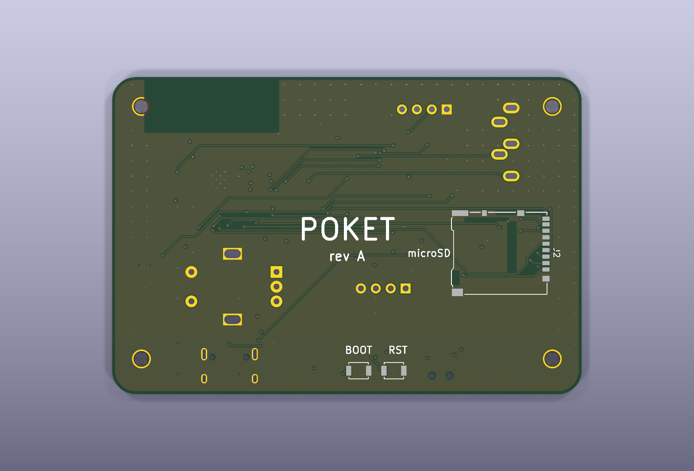
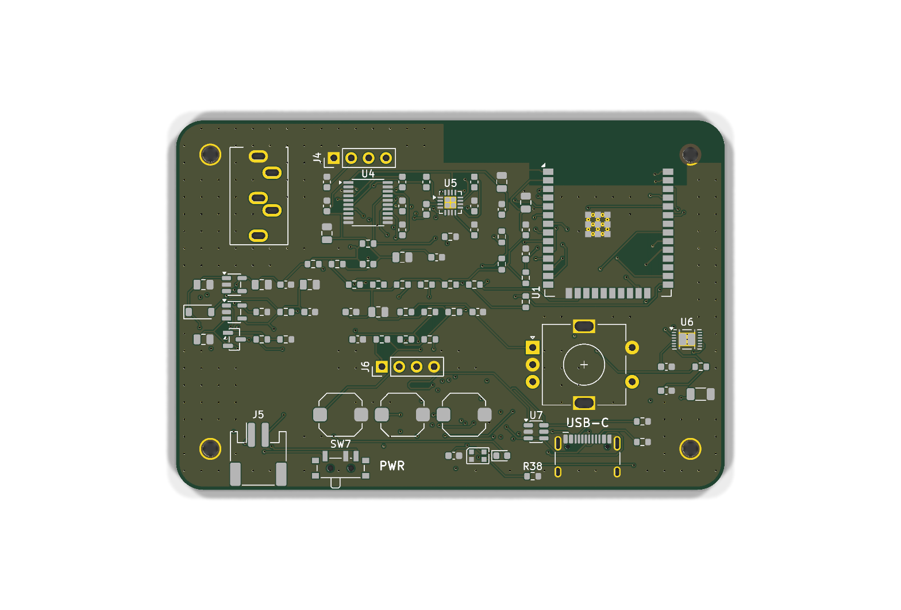
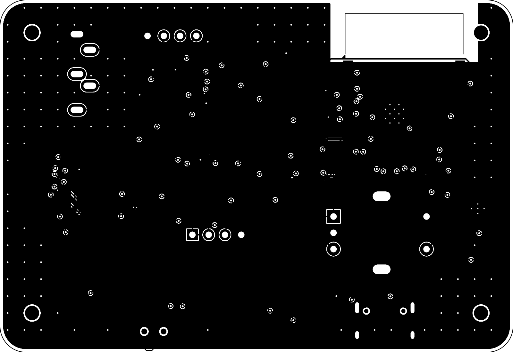
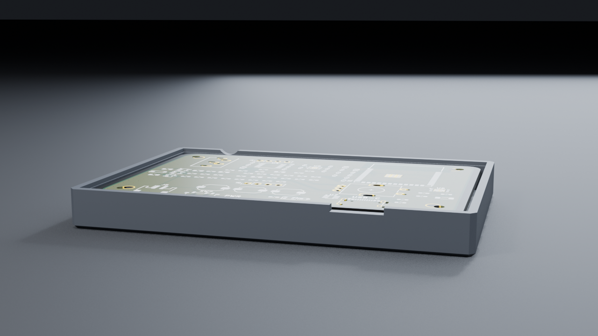
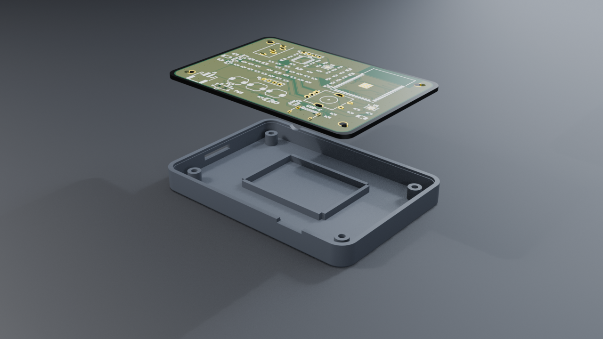
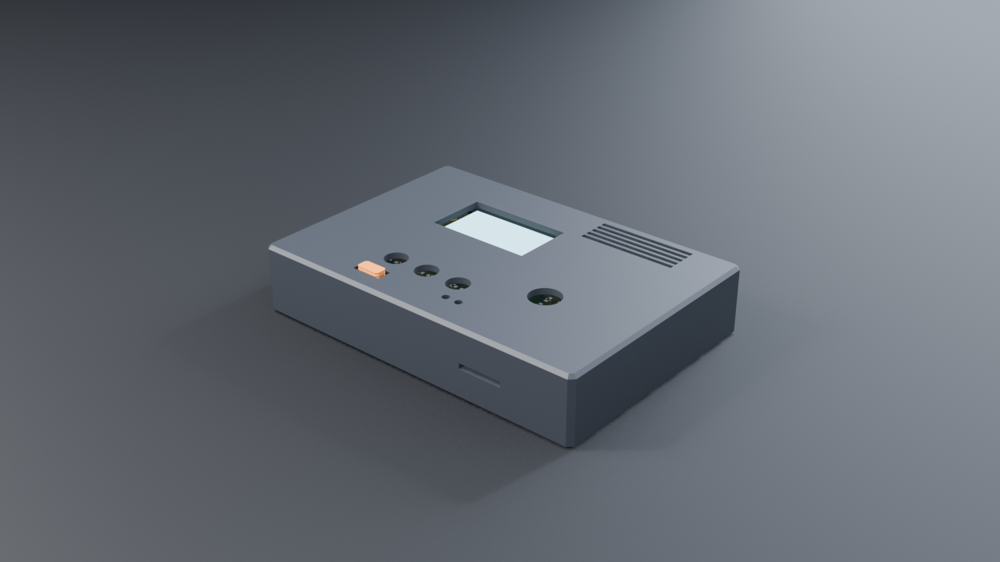
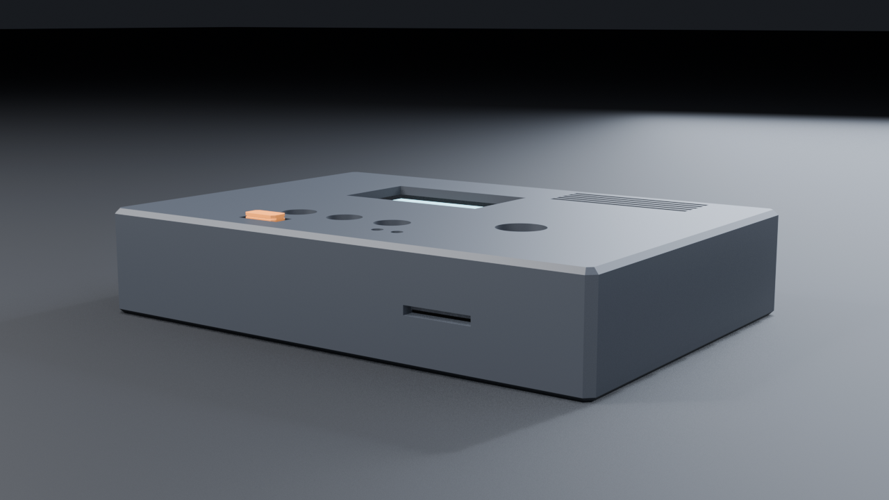
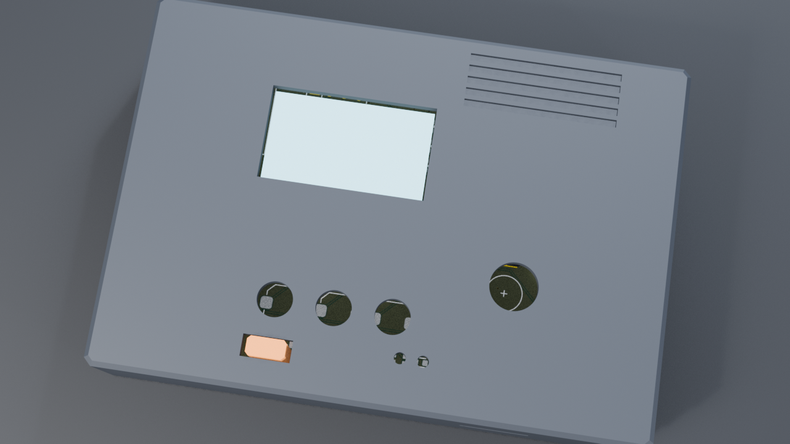
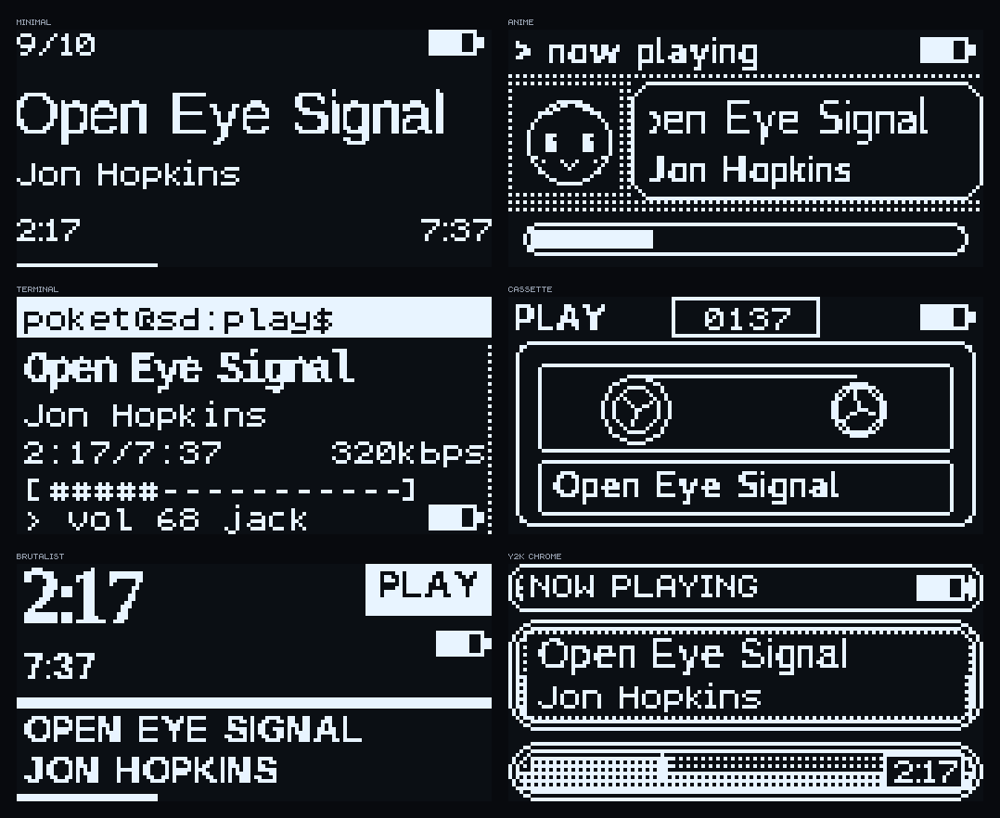

# Sep 9: Scoping + part picks

Nailed down what this actually is: plays MP3s off a microSD, sends to BT
headphones (A2DP source) OR out a 3.5mm jack. OLED + encoder + 3 buttons.
LiPo with USB-C charging and a real fuel gauge.

Part hunt in the KiCad libs:
- ESP32-S3-WROOM-1-N16R8 (module, not bare chip — no RF matching to get wrong)
- PCM5102A I2S DAC. no MCLK needed, internal PLL. one less pin to burn
- PAM8908 headphone amp. charge pump = ground-centered output = no fat
  DC blocking caps in the audio path
- MCP73831 charger + DMG2301L load-share P-FET
- AP2112K-3.3 LDO
- Wanted MAX17048 for the fuel gauge but there's no symbol in KiCad and I
  wasn't confident enough in the pinout from memory. Went BQ27441-G1
  instead — symbol exists, guaranteed right. Costs me a 10mR sense
  resistor in the pack ground.

Pin map done on paper first. Had to dodge GPIO35/36/37 (octal PSRAM on
the R8 module) and 19/20 (native USB).



**Total time spent: 2 hours**

# Sep 9: Schematic — power + charge block

Project created, sheet bumped to A1 because this is not fitting on A4.

Power block in. USB-C 16P with 5.1k CCs, USBLC6 for ESD. Charger at 500mA
(2k on PROG). Load share is VBUS->Schottky->VSYS, and a P-FET from VBAT
that gets turned off by VBUS on its gate.

Got the gate divider wrong the first time — 100k/100k puts the gate at
2.5V while the source sits at 4.2V, so Vgs is -1.7V and the FET is still
half on. Fixed: 10k straight from VBUS to gate, 1M pulldown. Now it's a
clean off.

Power switch is a slide switch on the LDO EN pin, not in the battery
path. No amps through a cheap slide switch.


**Total time spent: 2 hours**

# Sep 9: Schematic done — audio, storage, UI, ERC clean

Rest of the schematic in one sitting.

Audio chain: PCM5102A -> 1uF coupling -> PAM8908 -> 3.5mm jack. Tied SCK
low so the DAC runs off its internal PLL, FMT/DEMP/FLT low for plain I2S.
Jack has a switched tip so I get plug-detect on a GPIO for free.

microSD wired for 4-bit SDIO (not SPI) with 10k pullups on CMD and all
four data lines. Card detect on the DM3AT's detect switch.

Pin map final. Dodged IO35/36/37 (PSRAM), IO19/20 (USB), and left the
strapping pins (IO0/3/45/46) alone except boot.

ERC caught two things:
1. BQ27441 BAT pin "not driven" — it sits behind a 1k filter resistor so
   nothing drives it as far as ERC cares. PWR_FLAG on that net.
2. I'd stuck a PWR_FLAG on VBAT, which is already driven by the charger's
   VBAT output pin. Two power outputs on one net = error. Moved it.

Also caught myself wiring the encoder wrong — put GND on B and the signal
on C. On the KiCad symbol C is the common. Swapped.

0 errors, 0 warnings.


**Total time spent: 4 hours**

# Sep 10: PCB placement, and a fight with the ESP32 footprint

Board is 80 x 54 mm, 4 layers (sig / GND / GND / sig). Went 4-layer because
I wanted solid ground under the DAC and the SDIO bus, and JLC 4-layer is
barely more than 2.

Placement logic: front face is what you look at, so screen + buttons +
knob live on top. microSD went on the BOTTOM of the board so the slot
lines up with the left wall and the top side isn't eaten by a 15mm socket.
BOOT and RESET also went to the bottom — pinholes in the back shell
instead of ugly holes in the face.

Two things ate a lot of time:

**The ESP32-S3-WROOM-1 footprint has a giant antenna keepout zone baked
in** — 48 x 21mm, and it's a real copper keepout, not just a drawing. Its
courtyard outline is the same shape, so every part within 24mm of the
module "overlapped" it and DRC would have screamed. Deleted the zone from
the board instance and replaced the courtyard with a plain rectangle
around the module body, then shaped my own ground pours to leave a
52-74mm x 0-9.5mm notch open under the antenna. Same intent, sane size.

**I nuked the wrong zone the first time.** My paren-matcher found
`(zone_connect 2)` inside a pad before it found the actual `(zone ...)`
block and deleted that instead. Then on the second try I ate a keepout
belonging to the microSD footprint. Restored from backup twice. Third
attempt matched on `\n\t\t(zone\n` and checked the polygon coords before
deleting. Lesson: assert on something unique before you delete.

Also got bitten by 3.0mm pitch on 0603 rows — the courtyard is 3.05mm
wide, so a 3.0 pitch is a 0.05mm overlap. Everything is on 3.5 now.



**Total time spent: 5 hours**

# Sep 10: Enclosure

FreeCAD's RPC wasn't answering so I gave up on the GUI and scripted the
whole thing headless with FreeCADCmd. Actually nicer — the case is a
parametric script, so when the board moves the case follows.

86 x 60 x 16.8mm, two shells + a little slider cap, split just above the
PCB. Front shell has the display window, 3 button holes, the encoder shaft
hole, two LED pinholes, the power-slider slot, and a set of debossed vent
slots top-right that do nothing except make it look like it does something.
Back shell is a tray: 4 posts hold the PCB, ribs pen the battery in, M2
screws come in from the back into heat-set inserts in the front bosses.

Two geometry bugs:
- The registration lip came out as a separate floating solid. It was
  sitting in mid-air below the front wall — the wall only starts at the
  split plane, so a lip hanging below it touches nothing. Fixed by making
  the lip overlap 1mm up into the wall so there's actual volume overlap,
  not just coincident faces.
- The slider cap was 3mm too short to reach through the front face. Only
  spotted it in the render.

Wrote a tiny pure-Python STL renderer (painter's algorithm, no numpy on
this box) to get pictures out without a GUI.


**Total time spent: 4 hours**

# Sep 10: Routing. Four attempts.

No autorouter installed and no way around hand-routing 150 nets, so I
pulled freerouting. It needs a display — headless mode throws
HeadlessException — so it runs on the real X display and just doesn't
show a window worth looking at.

**Pass 1.** Routed, imported, 91 unconnected. Almost all GND: my copper
pours were sitting there unfilled. Filled them from a pcbnew script
(`tools/fill_zones.py`), down to 30. Set pad connection to solid instead
of thermal reliefs, added 284 stitching vias, down to 18.

**Pass 2.** The stubborn ones were all on U6, the BQ27441 fuel gauge.
Moved it somewhere less cramped and re-routed. Better, still 22 left, and
still mostly U6.

Then I worked out why. U6 is an SON-12 with 0.4 mm pad pitch. The DSN was
telling freerouting to use 0.2 mm traces with 0.2 mm clearance — 0.4 mm
of space needed per escape, into a 0.4 mm pitch. **It was geometrically
impossible and the router had been quietly giving up on it for two
passes.** Same story on the PAM8908's QFN.

**Pass 3.** Dropped clearance to 0.15 mm (JLC does 0.127), re-routed —
auto-routing finished in ten seconds instead of four minutes. Every
component-level net connected. 0 clearance errors after I remembered to
also set the netclass clearance in the .kicad_pro, since DRC reads that
and not the number I'd set through the MCP.

**Pass 4.** Noticed the router had put 439 mm of signal on In1.Cu, which
defeats the whole point of having a ground plane there. Marked In1.Cu as
`(type power)` in the DSN and ran it again. In1.Cu is now completely
clean — solid ground directly under every trace on the component side.

Left over: a handful of pour islands with a GND pad in them and no room
for a 0.5 mm via. Wrote `tools/tie_islands.py` to find each orphan island
and brute-force a spot for a via inside it using real point-to-segment
distance instead of bounding boxes (bounding boxes on diagonal traces
block half the board). Dropped to 0.4 mm vias for the last three.

Final: 741 tracks, 229 vias, 2.4 m of copper.
**0 DRC errors, 0 unconnected, 0 schematic parity.** Six warnings left,
all library bookkeeping — the mounting hole footprint name isn't in the
stock library, and two footprints differ from their library copies
because I edited them on purpose.




**Total time spent: 6 hours**

# Sep 10: Fit check + wrap up

Imported the KiCad board STEP into FreeCAD, shifted it +54 in Y to convert
from KiCad's Y-down to the case coordinates, and booleaned it against both
shells. Front shell: zero interference. Back shell: 1.9 mm³, which is the
four support posts touching the underside of the board — that's what
they're for, and it lines up with the ~0.04 mm soldermask film the export
puts below z=0.

Cutouts all land where they should: USB-C and the power slider on the
bottom edge, jack on top, microSD out the left, encoder shaft and three
buttons through the face, BOOT/RST as pinholes in the back.

Shipped: gerbers + drill + pick-and-place + BOM in `fab/`, STEP and STL
for all three printed parts in `enclosure/`.


**Total time spent: 1 hour**

# Sep 10: Rebuilt the case in FreeCAD proper

The FreeCAD RPC came back up, so I threw away the headless workaround and
rebuilt the enclosure through the real GUI session. Same parametric
approach, but now I can actually look at it, and the KiCad board STEP is
loaded into the same document so the fit check is live instead of a
number in a terminal.

Immediately worth it — **the slider cap was four loose pieces.** The three
thumb grooves were cutting the full width of the part, so each one sliced
it clean through. The headless script only ever printed solid counts for
the two shells, so it slid past me and went straight into an STL I would
have printed. Grooves now bite in 0.8 mm from each long side and leave a
1.6 mm core. One solid.

Also fixed while I was in there:
- assembly STEP no longer bundles the board, and I re-exported the board
  STEP without tracks and zones — 12.5 MB down to 136 KB
- STLs meshed at 0.02 mm linear deflection instead of the default, so the
  fillets actually look like fillets (back shell 18.8k triangles)
- deleted my hand-rolled STL renderer, `cad/stlrender.py`. It existed
  purely because there was no GUI to screenshot. There is now.

Interference check with the lighter board model: **0.0000 mm³ everywhere**
— shells against each other, shells against the board, cap against the
front shell. The 1.9 mm³ I saw before was the soldermask film the old
export put below z=0.




**Total time spent: 2 hours**

# Sep 10: Assembly animation in Blender

Wanted a clip that shows how the thing goes together, so: pulled the three
printed parts and the board into Blender as STLs, dropped them in from
above one at a time, then a full turntable. 194 frames, 1280x720, 30fps,
6.5 seconds.

The board is not modelled — KiCad's 3D model packages aren't installed on
this box, so the STEP export is a bare slab. Instead I rendered the board
orthographically from top and bottom with a transparent background, found
the board's silhouette in the alpha channel with numpy to get the exact
crop, and projected those two images onto the slab in object space,
picking top vs bottom by the sign of the surface normal. Traces, gold
pads and the silkscreen all read properly, and you can see the board
through the display window once the lid is on.

Three things went wrong:

- **Everything rendered pure white.** I'd copied light energies out of
  habit — 130 W area lights, 25 cm from an 8 cm object. Nine watts is
  about right at this scale.
- **Blotchy triangular shading on flat faces.** `shade_smooth_by_angle`
  needs the objects *selected*, not just active. I'd only set the active
  object, so it silently did nothing and the STL triangles showed through.
- **Blender lost the whole scene** partway through, so I rebuilt it as one
  script and saved the .blend. `blender/build_scene.py` rebuilds it from
  nothing.

Also: this Blender has no ffmpeg writer, so it renders a PNG sequence and
ffmpeg stitches it outside.




**Total time spent: 3 hours**

# Sep 10: Squared the edges, promo film, BOM

**Edges.** Swapped every fillet on the enclosure for a 45° chamfer — 1.2 mm on
the four outer vertical corners, 0.8 mm on the top and bottom rims. Straight
bevels, no curves anywhere you can see. Internal features (cavity, lip, rebate)
are just square now; nobody looks at them and square corners make the booleans
behave. Side effect I didn't expect: the STL dropped from 18.8k triangles to
3.8k, because there are no curved surfaces left to tessellate.

Re-ran the interference check against the board — still 0.0000 mm³ everywhere.

**Promo.** 22 seconds, five shots cut with camera-bound timeline markers: low
hero orbit, exploded build, top-down push-in, a low pass across the port side,
then a turntable. Added an emissive plane behind the display window so the
screen is lit — it goes dark when the board is out and comes back when the lid
lands, which sells the cut better than I expected.

Titles are done in ffmpeg with drawtext rather than in Blender, because this
Blender has no ffmpeg writer anyway so everything goes through a PNG sequence.

Two framing fixes: the floor plane's far edge was drawing a horizon line across
the wide shots (floor is 6× bigger now), and the low side camera was seeing the
emissive screen plane edge-on so it looked dead (raised the camera).

**Lost the .blend** partway through — deleted by accident. Cost nothing, because
`build_scene.py` rebuilds the whole scene from the STLs and the two board
renders. Folded the promo setup into the same script with a `MODE` switch so
there's exactly one file to keep.

**BOM.** 98 parts, 41 line items, ≈$46 for one unit — $24 of that electronics,
$22 PCB and hardware. Deliberately left the supplier part-number column empty:
I'm not confident enough in specific LCSC `C` numbers to write them down, and a
wrong one means the wrong part arrives. MPNs are real, prices are labelled as
estimates.

Also wrote an assembly guide and an honest submission checklist. Short version:
the design is done and manufacturable, but nothing has been built and there's no
firmware, so I'm not going to claim it works.




**Total time spent: 4 hours**

# Sep 13: Firmware — drivers, six themes, and a fight with fonts

Project got returned by a smith: no firmware in the repo, and the README was
missing pictures of the board. Fair.

Pulled the pin map straight out of the schematic netlist XML into `board.h` so
the firmware can't drift from the hardware. Then wrote down the stack:

- `drivers/` — I2C bus, SSD1306, encoder+buttons, BQ27441 fuel gauge
- `storage/` — SDMMC 4-bit mount, library scan, ID3 tags
- `audio/` — minimp3 decode into one sink interface, I2S or A2DP behind it
- `ui/` — 1-bit framebuffer + theme engine

**Themes.** Six of them. The point the user asked for was "anime theme,
minimalist theme and so on" — but on a 1-bit 128×64 panel there's no colour to
swap, so a theme has to differ in layout, typeface, icons and motion or it's
nothing. Minimal / Anime / Terminal / Cassette / Brutalist / Y2K. Custom
uploads land as *data*, never code — a theme pack from a browser must not be
able to execute on the device.



**Fonts ate the day.** No PIL, no freetype on this machine, so the rasteriser
is SVG → rsvg-convert → ffmpeg → threshold. Three separate things wrong with it:

1. At 7–8px the threshold ate the stems. `n` came out as two dots, `:` as one.
   Fixed by not using an outline at all down there — hand-drew a 5×8 table.
2. At 9–10px it lost the top arm off `E`. It was thresholding the 1:1
   anti-aliased render, so a half-covered column never cleared the cut. Now it
   renders 4× and box-filters down, so the threshold sees real coverage.
3. **librsvg was ignoring `@font-face src:url()` entirely.** All nine "different
   typefaces" were the same fallback sans. Rendered an R in four faces and got
   four identical bitmaps. Naming the face by fontconfig family instead fixed
   it — the brutalist numerals are actually a serif now.

**Clipping bug.** The marquee scrolled its text and then blanked the overspill
with two 40px rectangles. Those rectangles were erasing whatever the theme had
drawn beside the line — which is why the anime face was missing its top half
for an hour. `gfx` has a real clip rect now and the marquee sets it.

**Web app prototypes.** Four directions for the page the device serves over its
own AP: J-Card, bench instrument, fab drawing, and a plain settings page as the
control. The OLED preview in all four is a JS port of `gfx.c` running the same
theme code against the same generated glyph bytes — and it paints at an
**integer** zoom with smoothing off, so one panel pixel is exactly N×N screen
pixels. Wrote a test that asserts that at 1/2/3/4/6/8/10× across all six themes.

Still to do: the app shell, the Wi-Fi + HTTP layer, `main.c`. Nothing has been
flashed to hardware.

**Total time spent: 6 hours**

# Sep 14: The S3 can't do Bluetooth audio. New MCU.

Went to build the firmware for real and the compiler stopped me: `esp_bt.h`
has no `esp32s3` directory, and `soc_caps.h` says why —

```
soc/esp32/include/soc/soc_caps.h:442:   #define SOC_BT_CLASSIC_SUPPORTED (1)
soc/esp32s3/include/soc/soc_caps.h:551: #define SOC_BLE_SUPPORTED        (1)   <- and nothing else
```

**A2DP needs Bluetooth Classic. The ESP32-S3 has BLE only.** The headline
feature of this thing — send audio to Bluetooth headphones — was never going to
work on the part I picked. `CONFIG_BT_CLASSIC_ENABLED` doesn't even exist as a
config symbol for that target.

So: new MCU. **ESP32-WROOM-32E-N16R2.** Checked the Espressif datasheet properly
this time instead of going on vibes:
- ESP32-D0WDR2-V3, Classic BT + BLE, 16 MB flash
- 2 MB PSRAM **inside the chip package** — so unlike a WROVER it doesn't eat
  GPIO16/17. Only GPIO16 is gone (PSRAM), plus 6–11 for flash.

Knock-on effects, all of them real work:

**No native USB.** The classic ESP32 doesn't have it. Added a CP2102N-A02-GQFN24
and the cross-coupled auto-reset pair. Read the datasheet rather than copying a
random schematic, and it paid for itself three times:
1. The VBUS *sense* pin must not see 5 V — abs max is VIO + 2.5 V. It needs a
   22.1k/47.5k divider. I'd have wired it straight to VBUS.
2. RSTb wants a **1k** pull-up to VIO, not the 10k I'd guessed.
3. 4.7 µF **and** 0.1 µF at *every* power pin, not one pair for the chip.

**The auto-reset transistors were backwards.** A blog described both emitters
going to ground; its own truth table contradicted that. Pulled Espressif's
DevKitC schematic and the table is right there: DTR=1,RTS=0 → EN low;
DTR=0,RTS=1 → IO0 low; both asserted → neither. That only works cross-coupled —
Q_EN base=DTR emitter=RTS, Q_IO0 base=RTS emitter=DTR. Which is the whole point:
opening a serial port asserts both, and the board must *not* reset.

**microSD moved from 4-bit SDIO to SPI.** On the classic ESP32 the 4-bit slot
puts DAT2 on GPIO12 — MTDI, the flash-voltage strap. A card's internal pull-up
holds it high at reset, tells the bootloader the flash is 1.8 V, and bricks the
boot. Espressif's own docs say so. SPI costs bandwidth nobody needs here: 320
kbps audio is 40 kB/s.

**Dropped the battery-sense divider.** Every ADC1 pin is taken by the encoder and
the three input-only buttons, and ADC2 stops working when Wi-Fi is on — exactly
when the transfer screen wants to draw a battery. The BQ27441 reports voltage
over I²C anyway.

Schematic: ERC **0 errors, 0 warnings**. Verified all 20 firmware pins against
the netlist export — no mismatches.

PCB: ripped every track (none of it survives an MCU swap), swapped the footprint,
put the bridge block on the bottom next to the USB-C, re-routed. **DRC 0 errors,
0 schematic-parity issues, every signal net routed.** Three ground-pour fragments
are still untied — two of them hold a bypass cap's ground. Noted, not hidden.

Enclosure rebuilt against the new board: three valid single solids, and the
boolean against the real board STEP is **0.0000 mm³** on both shells. The outline
and every connector stayed put, so the case still fits.

Two hours of that was me fighting the autorouter instead of fixing placement
first. Routing is a placement problem.

**Total time spent: 7 hours**
