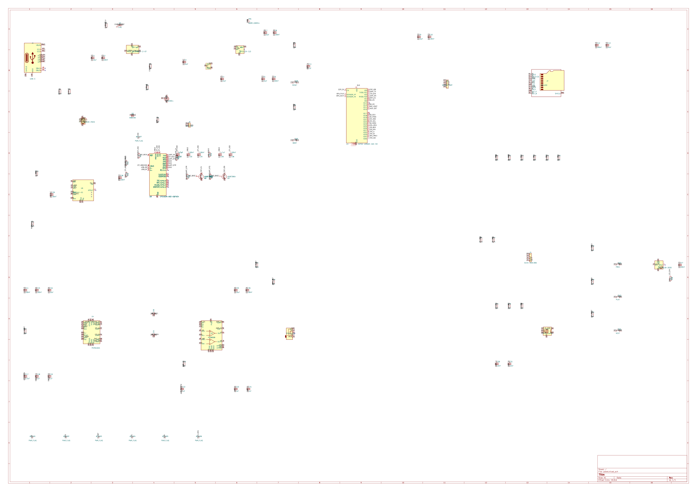
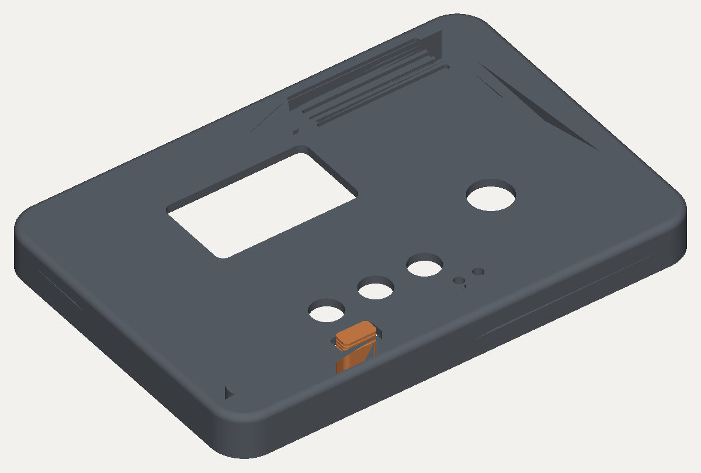
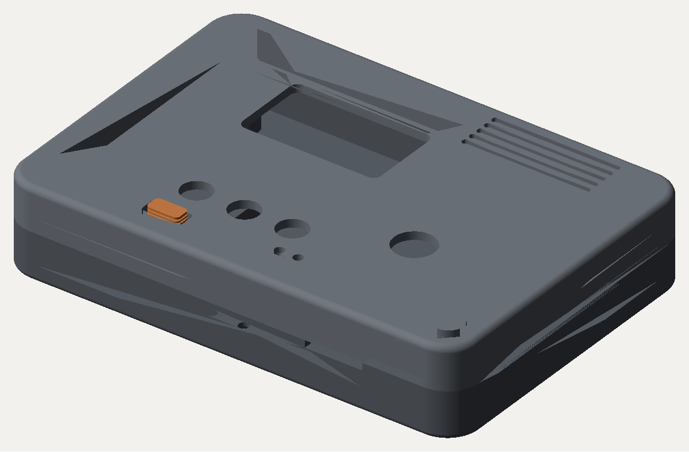
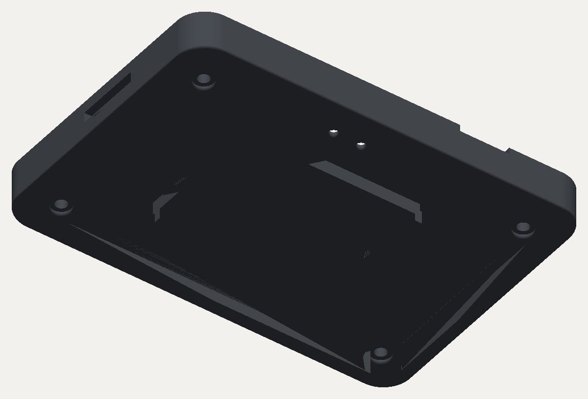

# Sep 9: Scoping + part picks

Nailed down what this actually is: plays MP3s off a microSD, sends to BT
headphones (A2DP source) OR out a 3.5mm jack. OLED + encoder + 3 buttons.
LiPo with USB-C charging and a real fuel gauge.

Part hunt in the KiCad libs:
- ESP32-S3-WROOM-1-N16R8 (module, not bare chip — no RF matching to get wrong)
- PCM5102A I2S DAC. no MCLK needed, internal PLL. one less pin to burn
- PAM8908 headphone amp. charge pump = ground-centered output = no fat
  DC blocking caps in the audio path
- MCP73831 charger + DMG2301L load-share P-FET
- AP2112K-3.3 LDO
- Wanted MAX17048 for the fuel gauge but there's no symbol in KiCad and I
  wasn't confident enough in the pinout from memory. Went BQ27441-G1
  instead — symbol exists, guaranteed right. Costs me a 10mR sense
  resistor in the pack ground.

Pin map done on paper first. Had to dodge GPIO35/36/37 (octal PSRAM on
the R8 module) and 19/20 (native USB).

**Total time spent: 2 hours**

# Sep 9: Schematic — power + charge block

Project created, sheet bumped to A1 because this is not fitting on A4.

Power block in. USB-C 16P with 5.1k CCs, USBLC6 for ESD. Charger at 500mA
(2k on PROG). Load share is VBUS->Schottky->VSYS, and a P-FET from VBAT
that gets turned off by VBUS on its gate.

Got the gate divider wrong the first time — 100k/100k puts the gate at
2.5V while the source sits at 4.2V, so Vgs is -1.7V and the FET is still
half on. Fixed: 10k straight from VBUS to gate, 1M pulldown. Now it's a
clean off.

Power switch is a slide switch on the LDO EN pin, not in the battery
path. No amps through a cheap slide switch.

**Total time spent: 2 hours**

# Sep 9: Schematic done — audio, storage, UI, ERC clean

Rest of the schematic in one sitting.

Audio chain: PCM5102A -> 1uF coupling -> PAM8908 -> 3.5mm jack. Tied SCK
low so the DAC runs off its internal PLL, FMT/DEMP/FLT low for plain I2S.
Jack has a switched tip so I get plug-detect on a GPIO for free.

microSD wired for 4-bit SDIO (not SPI) with 10k pullups on CMD and all
four data lines. Card detect on the DM3AT's detect switch.

Pin map final. Dodged IO35/36/37 (PSRAM), IO19/20 (USB), and left the
strapping pins (IO0/3/45/46) alone except boot.

ERC caught two things:
1. BQ27441 BAT pin "not driven" — it sits behind a 1k filter resistor so
   nothing drives it as far as ERC cares. PWR_FLAG on that net.
2. I'd stuck a PWR_FLAG on VBAT, which is already driven by the charger's
   VBAT output pin. Two power outputs on one net = error. Moved it.

Also caught myself wiring the encoder wrong — put GND on B and the signal
on C. On the KiCad symbol C is the common. Swapped.

0 errors, 0 warnings.

**Total time spent: 4 hours**

# Sep 10: PCB placement, and a fight with the ESP32 footprint

Board is 80 x 54 mm, 4 layers (sig / GND / GND / sig). Went 4-layer because
I wanted solid ground under the DAC and the SDIO bus, and JLC 4-layer is
barely more than 2.

Placement logic: front face is what you look at, so screen + buttons +
knob live on top. microSD went on the BOTTOM of the board so the slot
lines up with the left wall and the top side isn't eaten by a 15mm socket.
BOOT and RESET also went to the bottom — pinholes in the back shell
instead of ugly holes in the face.

Two things ate a lot of time:

**The ESP32-S3-WROOM-1 footprint has a giant antenna keepout zone baked
in** — 48 x 21mm, and it's a real copper keepout, not just a drawing. Its
courtyard outline is the same shape, so every part within 24mm of the
module "overlapped" it and DRC would have screamed. Deleted the zone from
the board instance and replaced the courtyard with a plain rectangle
around the module body, then shaped my own ground pours to leave a
52-74mm x 0-9.5mm notch open under the antenna. Same intent, sane size.

**I nuked the wrong zone the first time.** My paren-matcher found
`(zone_connect 2)` inside a pad before it found the actual `(zone ...)`
block and deleted that instead. Then on the second try I ate a keepout
belonging to the microSD footprint. Restored from backup twice. Third
attempt matched on `\n\t\t(zone\n` and checked the polygon coords before
deleting. Lesson: assert on something unique before you delete.

Also got bitten by 3.0mm pitch on 0603 rows — the courtyard is 3.05mm
wide, so a 3.0 pitch is a 0.05mm overlap. Everything is on 3.5 now.

**Total time spent: 5 hours**

# Sep 10: Enclosure

FreeCAD's RPC wasn't answering so I gave up on the GUI and scripted the
whole thing headless with FreeCADCmd. Actually nicer — the case is a
parametric script, so when the board moves the case follows.

86 x 60 x 16.8mm, two shells + a little slider cap, split just above the
PCB. Front shell has the display window, 3 button holes, the encoder shaft
hole, two LED pinholes, the power-slider slot, and a set of debossed vent
slots top-right that do nothing except make it look like it does something.
Back shell is a tray: 4 posts hold the PCB, ribs pen the battery in, M2
screws come in from the back into heat-set inserts in the front bosses.

Two geometry bugs:
- The registration lip came out as a separate floating solid. It was
  sitting in mid-air below the front wall — the wall only starts at the
  split plane, so a lip hanging below it touches nothing. Fixed by making
  the lip overlap 1mm up into the wall so there's actual volume overlap,
  not just coincident faces.
- The slider cap was 3mm too short to reach through the front face. Only
  spotted it in the render.

Wrote a tiny pure-Python STL renderer (painter's algorithm, no numpy on
this box) to get pictures out without a GUI.

**Total time spent: 4 hours**
