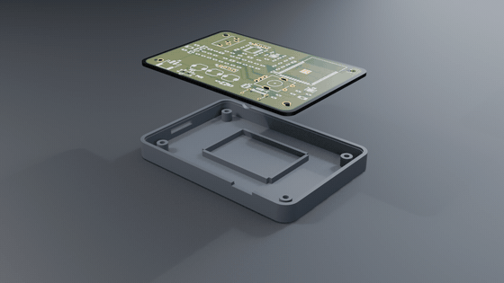

# Poket

A pocket Bluetooth MP3 player built around an ESP32-S3.

Plays MP3s off a microSD card and sends them either to Bluetooth
headphones (A2DP source) or out a 3.5 mm jack. 0.96" OLED, rotary
encoder, three transport buttons, LiPo with USB-C charging and a
coulomb-counting fuel gauge.

| | |
|---|---|
| MCU | ESP32-S3-WROOM-1-N16R8 (16 MB flash, 8 MB octal PSRAM) |
| Storage | microSD, 4-bit SDIO |
| DAC | PCM5102A (I2S, internal PLL — no MCLK needed) |
| Headphone amp | PAM8908, charge-pump / ground-centred output |
| Charger | MCP73831, 500 mA, P-FET load share |
| Fuel gauge | BQ27441-G1 with 10 mΩ sense resistor |
| Rail | AP2112K-3.3, separate ferrite-isolated 3V3A for the audio |
| Board | 80 × 54 mm, 4 layer (Sig / solid GND / Sig / Sig) |
| Case | 86 × 60 × 16.8 mm, 3D printed, two shells + slider cap, chamfered edges |

## Video

| | |
|---|---|
| [`video/poket-promo.mp4`](video/poket-promo.mp4) | 22 s product film — five shots, titles |
| [`video/poket-assembly.mp4`](video/poket-assembly.mp4) | 6.5 s — parts drop in, then a turntable |



Both are rendered from the same Blender scene, which rebuilds from scratch
with `blender/build_scene.py` (set `MODE` to `"promo"` or `"assembly"`).
Encode the PNG sequences with `tools/encode_video.sh`.

## Documentation

- [`docs/BOM.md`](docs/BOM.md) — bill of materials, ~$46/unit
- [`docs/ASSEMBLY.md`](docs/ASSEMBLY.md) — how to build one
- [`docs/DESIGN.md`](docs/DESIGN.md) — why each part was chosen, and the trade-offs
- [`docs/SUBMISSION.md`](docs/SUBMISSION.md) — what's done, what isn't
- [`JOURNAL.md`](JOURNAL.md) — build log

## Repo layout

```
poket.kicad_sch / .kicad_pcb / .kicad_pro   KiCad 10 project
cad/enclosure.py                            parametric enclosure (FreeCAD, headless)
enclosure/*.step, *.stl                     exported case parts
docs/                                       BOM, assembly, design notes, schematic PDF
fab/                                        gerbers, drill, pick-and-place
images/                                     renders and screenshots
blender/                                    animation scene + board textures
video/                                      promo + assembly animations
tools/                                      fab export, video encode, PCB helper scripts
JOURNAL.md                                  build log
```

## Building the enclosure model

```
flatpak run --filesystem=host --command=FreeCADCmd org.freecad.FreeCAD cad/enclosure.py
```

Everything is driven by the constants at the top of `cad/enclosure.py`, so
if the PCB outline or a connector moves, change the number and re-run.

## Print settings

PETG or PLA, 0.2 mm layers, 4 perimeters, 20 % infill, no supports needed.
Front shell prints face-down, back shell prints tray-up. 4 × M2 heat-set
inserts (3.2 mm OD) in the front shell bosses; 4 × M2 × 12 screws from the
back.

## Status

Design complete and verified in software: **ERC 0 errors, DRC 0 errors,
0 unconnected nets, 0 schematic-parity issues**, and the enclosure booleans
against the real board outline with zero interference.

**Not yet built and no firmware written** — see
[`docs/SUBMISSION.md`](docs/SUBMISSION.md) for the honest gap list.

## License

MIT for code, CERN-OHL-S v2 for the hardware design files. See [`LICENSE`](LICENSE).
