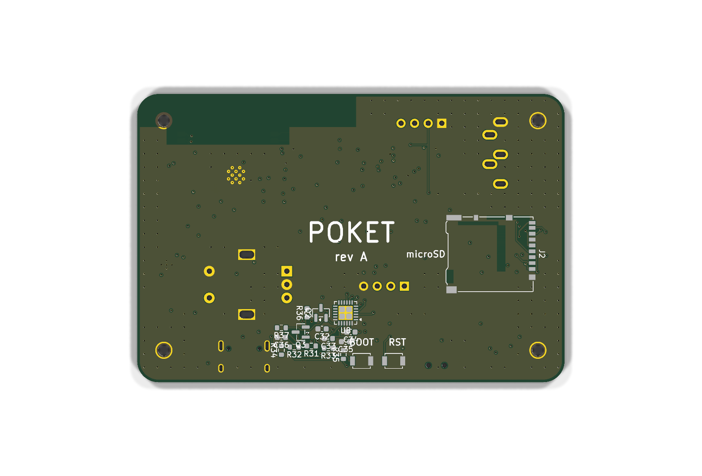

# Poket

A pocket Bluetooth MP3 player built around an ESP32-S3.

Plays MP3s off a microSD card and sends them either to Bluetooth
headphones (A2DP source) or out a 3.5 mm jack.

> **Rev B changed the MCU.** The board started on an ESP32-S3, which turned out
> to have Bluetooth LE only — no BR/EDR — so A2DP could never have worked on it.
> `soc_caps.h` in ESP-IDF spells it out: the S3 defines `SOC_BLE_SUPPORTED` and
> not `SOC_BT_CLASSIC_SUPPORTED`. The classic ESP32 in the WROOM-32E-R2 has
> both, keeps its 2 MB PSRAM inside the chip package (so GPIO16/17 stay free,
> unlike a WROVER), and costs a USB-UART bridge because it has no native USB. 0.96" OLED, rotary
encoder, three transport buttons, LiPo with USB-C charging and a
coulomb-counting fuel gauge.

| | |
|---|---|
| MCU | ESP32-WROOM-32E-N16R2 (16 MB flash, 2 MB in-package PSRAM) |
| Storage | microSD over SPI |
| DAC | PCM5102A (I2S, internal PLL — no MCLK needed) |
| Headphone amp | PAM8908, charge-pump / ground-centred output |
| Charger | MCP73831, 500 mA, P-FET load share |
| Fuel gauge | BQ27441-G1 with 10 mΩ sense resistor |
| Rail | AP2112K-3.3, separate ferrite-isolated 3V3A for the audio |
| USB | CP2102N-A02 bridge + cross-coupled auto-reset (this part has no native USB) |
| Board | 80 × 54 mm, 4 layer (Sig / solid GND / Sig / Sig) |
| Case | 86 × 60 × 16.8 mm, 3D printed, two shells + slider cap, chamfered edges |


## The board


Top side: ESP32-S3 module and its antenna keepout top-right, audio chain and
power block under where the OLED sits, encoder centre-right, three transport
buttons along the bottom, USB-C bottom-right, 3.5 mm jack top-left.



Bottom side carries the microSD socket and the BOOT/RESET buttons, so the top
face stays clean. Right: all four copper layers together — In1.Cu is a solid
ground plane with no signal on it at all.


Full schematic (also as a PDF: [`docs/poket-schematic.pdf`](docs/poket-schematic.pdf)).
ERC clean — 0 errors, 0 warnings.


## The firmware

ESP-IDF v5.3, C. Reads MP3s off the card with a vendored [minimp3], decodes
into PSRAM and pushes PCM to either sink — I2S to the PCM5102A, or A2DP source
to a paired pair of headphones.


Six themes ship, and they are not palette swaps — a 1-bit 128 x 64 panel has no
colour to vary, so each one earns its difference through layout, typeface,
iconography and motion. Clockwise from top-left: **Minimal**, **Anime**
(a face that blinks on its own timer), **Cassette** (reels that wind across as
the track plays), **Y2K Chrome**, **Brutalist**, **Terminal**. A seventh slot
takes a custom theme uploaded from the browser; that one is *data*, not code,
so an uploaded pack can lay out screens but can never execute on the device.

The two smallest faces are a hand-drawn 5x8 bitmap table
([`tools/font5x8.py`](firmware/tools/font5x8.py)) — rasterising an outline at
7-8 px loses whole stems, and a 1-bit panel has no antialiasing to hide that
with. The rest come from real faces through
[`tools/mkfont.py`](firmware/tools/mkfont.py).

### The web app

Hold the encoder and Poket brings up its own Wi-Fi access point and serves a
page: drag MP3s onto it to write them to the card, browse the library, drive
transport, and pick the screen theme with a **live 128 x 64 preview**. The
preview is not an artist's impression — `web/proto/oled.js` is a port of
`ui/gfx.c` and runs the same theme code against the same generated glyph bytes,
painted at an integer zoom so one panel pixel is exactly N x N screen pixels
with smoothing off.

Four design directions are prototyped in
[`firmware/web/proto/`](firmware/web/proto/) — open `index.html`:

| | |
|---|---|
| `jcard.html` | ink on cassette card stock; upload zone is a blank Side B |
| `bench.html` | desk instrument — keycaps with travel, knurled knob, amber readout |
| `fab.html` | the board documenting itself: silkscreen on solder mask, designators, title block |
| `plain.html` | the canon settings page; the control the other three have to beat |

Wi-Fi and Bluetooth share one radio, so while the page is being served audio
routes out the 3.5 mm jack.

[minimp3]: firmware/components/minimp3/

## Video

| | |
|---|---|
| [`video/poket-promo.mp4`](video/poket-promo.mp4) | 22 s product film — five shots, titles |
| [`video/poket-assembly.mp4`](video/poket-assembly.mp4) | 6.5 s — parts drop in, then a turntable |


Both are rendered from the same Blender scene, which rebuilds from scratch
with `blender/build_scene.py` (set `MODE` to `"promo"` or `"assembly"`).
Encode the PNG sequences with `tools/encode_video.sh`.

## Documentation

- [`docs/BOM.md`](docs/BOM.md) — bill of materials, ~$46/unit
- [`docs/ASSEMBLY.md`](docs/ASSEMBLY.md) — how to build one
- [`docs/DESIGN.md`](docs/DESIGN.md) — why each part was chosen, and the trade-offs
- [`docs/SUBMISSION.md`](docs/SUBMISSION.md) — what's done, what isn't
- [`JOURNAL.md`](JOURNAL.md) — build log

## Repo layout

```
poket.kicad_sch / .kicad_pcb / .kicad_pro   KiCad 10 project
firmware/                                   ESP-IDF app - drivers, audio, UI themes, web app
cad/enclosure.py                            parametric enclosure (FreeCAD, headless)
enclosure/*.step, *.stl                     exported case parts
docs/                                       BOM, assembly, design notes, schematic PDF
fab/                                        gerbers, drill, pick-and-place
images/                                     renders and screenshots
blender/                                    animation scene + board textures
video/                                      promo + assembly animations
tools/                                      fab export, video encode, PCB helper scripts
JOURNAL.md                                  build log
```

## Building the enclosure model

```
flatpak run --filesystem=host --command=FreeCADCmd org.freecad.FreeCAD cad/enclosure.py
```

Everything is driven by the constants at the top of `cad/enclosure.py`, so
if the PCB outline or a connector moves, change the number and re-run.

## Print settings

PETG or PLA, 0.2 mm layers, 4 perimeters, 20 % infill, no supports needed.
Front shell prints face-down, back shell prints tray-up. 4 × M2 heat-set
inserts (3.2 mm OD) in the front shell bosses; 4 × M2 × 12 screws from the
back.

## Status

Design complete and verified in software: **ERC 0 errors, DRC 0 errors,
0 unconnected nets, 0 schematic-parity issues**, and the enclosure booleans
against the real board outline with zero interference.

Firmware is in progress: drivers, the audio path, the library scanner, the
1-bit graphics layer and all six themes are written; the app shell and the
Wi-Fi/HTTP layer are not finished, so **nothing has been flashed to real
hardware yet**. See [`docs/SUBMISSION.md`](docs/SUBMISSION.md) for the honest
gap list.

## License

MIT for code, CERN-OHL-S v2 for the hardware design files. See [`LICENSE`](LICENSE).
